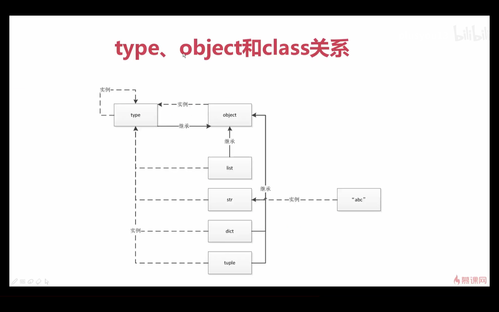

# 2.2 type、object和class的关系

type有两种用法：1. 用来生成一个类；2. 可以返回一个对象它的 <u>***类***</u> 型

关于如何通过type生成类，会在元类编程中讲解到

```python
a = 1
type(1)  # <class 'int'>  # 之前说过：class也是一个对象  1实际上是通过int这个类生成的一个对象，然后int这个类他本身也是一个对象
type(int)  # <class 'type'>  # int对象是由type这个类来生成的
# type --> int --> 1
```

所以关系就出来了：

type生成了int；int生成了1

这个对于我们的字符串类型来说也是一样的道理

```python
b = "abc"
type(b)  # <class 'str'>
type(str)  # <class 'type'>
```

普通的：type可以生成class；class可以生成obj(也就是我们的对象，这个对象就是我们平常静态语言中所经常听到的对象。不过，在python当中class它也是对象)

str和int都是内建的类，那如果我们自己去定义一个类呢？

```python
class Student:
    pass

stu = Student()
type(stu)  # <class '__main__.Student'>
type(Student)  # <class 'type'>
```

所以说，我们自定义的类也符合这个逻辑：type生成了class；class生成了obj

type、obj(这里指的是通过类生成的对象)和class的关系：type是用来生成类对象(class)的；然后我们平常所用的实例object,他就是我们自己定义的类或者说内置的一些类来生成的

内建的对象，我们常用的比如说：

```python
>>> a = [1, 2]
>>> type(a)
<class 'list'>
>>> type(list)
<class 'type'>
```

所以说，这里面得出了一个结论，就是：我们的类它是由type这个类来生成的一个对象；我们平常所熟悉的对象，它是由我们的类对象来创建的一个对象。

所以说，type和类之间的关系就明白了：type是用来生成类的

object它实际上是我们所有类都要继承的一个最顶层的一个基础类。

```python
>>> class Student:
...     pass
...
>>> stu = Student()
>>> type(stu)
<class '__main__.Student'>
>>> Student.__bases__  # 查看Student继承自哪个类
(<class 'object'>,)
>>>
>>> class MyStudent(Student):  
...     pass
...
>>> MyStudent.__bases__  # 查看MyStudent继承自哪个类
(<class '__main__.Student'>,)
>>>
```

object是最顶层基类

type也是一个类，同时type也是一个对象

```python
>>> type.__bases__  # type这个类，它的继承自object
(<class 'object'>,)

>>> type(type)
<class 'type'>  # type是由type生成的  type他也是自身的一个实例
```

看一下object这个对象或者说这个类它是由谁来生成的呢？

```python
>>> type(object)
<class 'type'>  # object它是type的一个实例
```

```python
>>> object.__bases__  # 我们的最顶层的基类它的基类是空，是没有的
()
```



